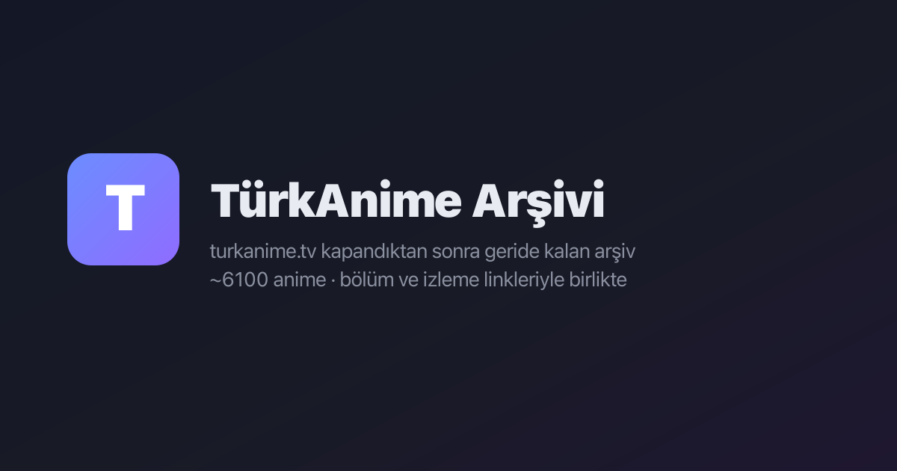

<div align="center">

# 📺 TürkAnime Arşivi

**turkanime.tv kapandıktan sonra geride bıraktığı arşivi yaşatan, sunucusuz (statik) bir web uygulaması.**

~6100 anime · bölüm/izleme linkleri · AniList kapak görselleri — tek sayfalık bir viewer.


**[👉 Canlı demo](https://berke-aras.github.io/turkanime-arsiv/)**



</div>

## ✨ Özellikler

- 🔎 Yazım hatasına toleranslı arama (Levenshtein tabanlı)
- 🎛️ Kategori / tür / puana göre filtreleme ve sıralama
- ⭐ Favoriler ve son bakılanlar (localStorage)
- 🌟 Günün Animesi (puanı 7+ olanlardan, gün boyunca sabit kalan seçim)
- 🎲 Rastgele anime butonu
- ⚡ Tamamen statik: build adımı olmadan doğrudan açılabilir

## 🚀 Çalıştırma

```bash
python3 -m http.server 8000
# veya
npx serve .
```

`index.html`'i açman yeterli.

## ⚡ Reklamsız Sibnet oynatıcı

Sibnet videoları iframe yerine sitenin kendi `<video>` oynatıcısında reklamsız açılır ("Reklamsız izle" butonu, önerilen). Orijinal SIBNET butonları da durur.

Bunun için `api/sibnet.js` küçük bir Vercel serverless function olarak çalışır (proje: `tka-sibnet`, `https://tka-sibnet.vercel.app/api/sibnet?id=<videoid>`): sibnet sayfasından mp4 yolunu alır, Referer ile yönlendirmeleri takip edip Referer gerektirmeyen nihai CDN linkini döndürür. Video trafiği fonksiyondan geçmez. (Cloudflare Workers denendi; sibnet CF IP'lerini 403 ile engelliyor.)

## 🗂️ Yapı

```
index.html / app.js / style.css / meta.js   → viewer uygulaması
kaynak/data.js                               → anime listesi (slug, başlık, bölüm/link sayısı)
kaynak/b/<slug>.js                           → her anime için bölüm + izleme linkleri
kaynak/animeler/<slug>/info.json             → özet, kategori, puan gibi detay bilgisi
scripts/build-meta.js                        → info.json'lardan meta.js üretir
scripts/build-posters.js                     → AniList'ten poster URL'lerini çekip meta.js'e gömer
```

Veride bir değişiklik olursa sırayla `node scripts/build-meta.js` ve `node scripts/build-posters.js` çalıştırılır.

## 📝 Not

Bölüm linkleri farklı video sağlayıcılara (GDrive, Mp4upload, vb.) ait; bu proje sadece arşivlenmiş linkleri düzenli bir arayüzde sunar, dosyaları barındırmaz.

---

<div align="center">

Special thanks to **[Kerim Demirkaynak](https://github.com/KerimDemirkaynak)** — turkanime.tv kapanmadan önce bu arşivi (bölüm/izleme linkleri) derleyip paylaştığı için.

</div>
